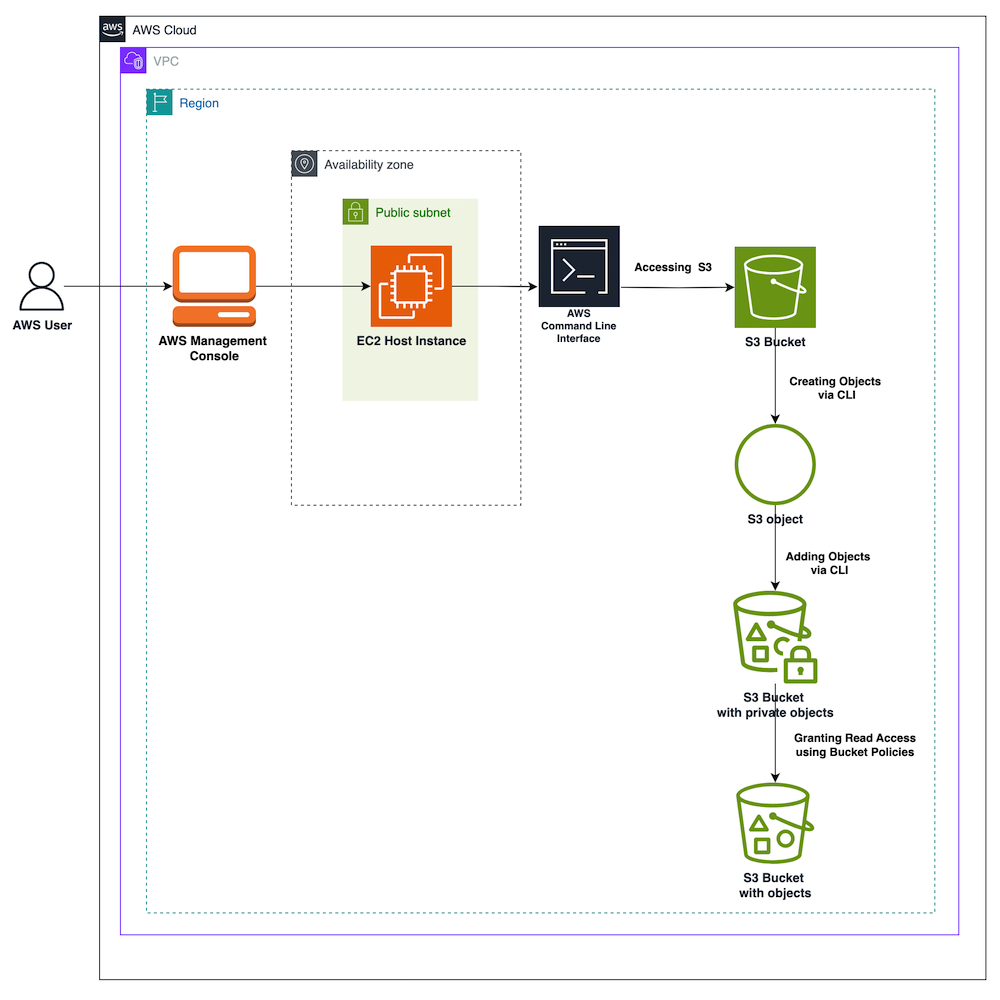

# AWS Amazon S3: Bucket creation and objects Access Control using AWS CLI #

## Project Description

In this project, I explored the capabilities of Amazon Simple Storage Service (Amazon S3) by
creating an S3 bucket, uploading objects, and configuring permissions to make those objects
publicly accessible. Additionally, I used the AWS Command Line Interface (AWS CLI) to list
bucket contents, demonstrating fundamental S3 operations.

This hands-on practice enhanced my understanding of cloud storage, object permissions, and
CLI-based AWS interactions.

## Architecture Overview

## Technologies Used

- **Amazon S3**: Scalable object storage.
- **AWS CLI**: Command-line tool to interact with AWS services.
- **Amazon EC2**: Instance for CLI execution.
- **IAM (Identity and Access Management)**: Secure access management.
- **app.diagrams.net**: Architecture design visualization tool.

## Complete Project

[Complete Project .PDF](https://github.com/juleannynavas/-aws-s3-creation-objects-access-control-aws-cli/blob/main/S3_IAM_CLI%20.pdf)

## Acknowledgments

- AWS re/Start / Factoría F5 mentoring
- AWS Documentation and Best Practices
- Open source tools that make database migrations possible
